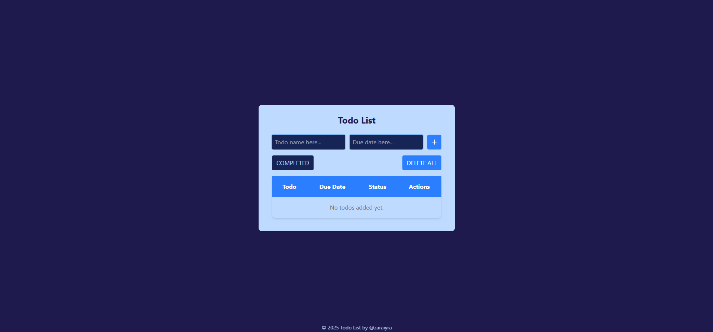

# Todo List
A simple To Do List to track your task easily.

## Table of Contents
- [Usage](#usage)
- [Warning](#warning)
- [Thanks to](#thanks)

## Usage
You can create a task by adding a todo name and the due date, then just click the plus button. And ✨ VOILA ✨ you just added a new todo.

### Additional Features
- You can also mark it as completed by clicking on the check button. Then, the status will automatically change to 'Completed'.
- You can filter view for completed todo, by clicking on COMPLETED button.
- You can delete the task by clicking on the trash button.
- Last but not least, you can delete all the todos by clicking on the DELETE ALL button.

## Warning
This app will not store your todo permanently, once refreshed, you'll lose it all.

## Thanks
- [Tailwind.css](https://tailwindcss.com)
- [Font Awesome](https://fontawesome.com)
- [Flatpickr](https://flatpickr.js.org)
- [Favicon.io](https://favicon.io)

